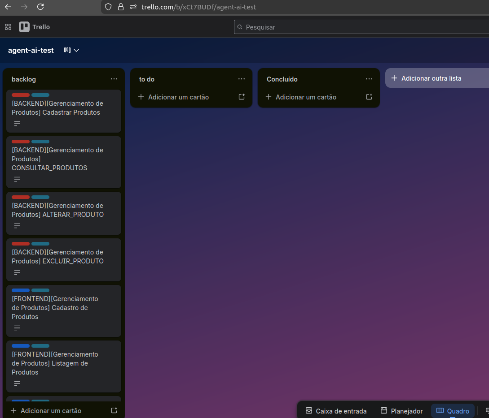

# ai-acceptance-engine

## Visão geral

Ferramenta de inteligência artificial para automação do planejamento de projetos de software. A partir de um requisito funcional escrito em linguagem natural, o sistema analisa, decompõe e cria automaticamente cards de desenvolvimento no Trello para as equipes de backend e frontend — com descrições estruturadas, rastreáveis e prontas para execução.
Esta versão 1 gera cards com:

- título
- etiquetas (labels)
- decrição com :

  - Decritivo funcional
  - Critérios de aceite
  - Campos principais
  - Permissões

## Objetivo do projeto

Reduzir o tempo e o esforço manual gasto por líderes técnicos na criação e detalhamento de cards de desenvolvimento, garantindo padronização, rastreabilidade e cobertura completa dos requisitos funcionais.

## Exemplo:

Dado um requisito funcional como:

> ```
> RF01P: O sistema deverá permitir que usuários com perfil de Gerente cadastrem, consultem, alterem e excluam Produtos.
> RN01P: Cada Produto deve conter os seguintes campos:
>     [Ob] Nome (obrigatório, mín. 5 caracteres, máx. 200);  
>     [Ob] Quantidade disponível (obrigatório, inteiro positivo) ;  
>     [Ob] Preço compra (decimal positivo); 
>     [Ob] Preço venda (decimal positivo); 
>     [Ob] Categoria associada  (id de categoria pré-existente); 
>     [Ob] Descrição (texto livre, máx. 1000 caracteres);
>     [Ob] Mídias 
> ```

O sistema executa automaticamente o seguinte pipeline:

1. **Analisa o requisito** — extrai módulo, perfis de acesso, regras de negócio e entidades do domínio
2. **Levanta as funcionalidades** — identifica todas as responsabilidades técnicas de backend e frontend previstas no requisito
3. **Valida contra o requisito original** — remove funcionalidades inferidas que não estão explicitamente descritas
4. **Detalha cada funcionalidade** — levanta endpoint, campos, regras específicas, ações e critérios de aceite
5. **Formata os cards** — gera títulos e descrições completas no padrão `.md` definido pelo time
6. **Publica no Trello** — cria os cards nas listas de backend e frontend com título, descrição estruturada e rastreabilidade ao requisito

### Resultados




```
INFO | services.trello_service | Criando card '[FRONTEND][Gerenciamento de Produtos] Exclusão de Produto' na lista '69a8968aec3b3b60bcf0b08e'...
INFO | services.trello_service | Card criado com sucesso: https://trello.com/c/G7Bqpzse
INFO | skills.publicar | Frontend story '[FRONTEND][Gerenciamento de Produtos] Exclusão de Produto' com 2 tags: ['frontend', 'modulo-gerenciamento-de-produtos']
INFO | skills.publicar | Iniciando associação de 2 tags ao card 69cd125a6f2bb770363d391b
INFO | skills.publicar | Processando tag: 'frontend'
INFO | services.trello_service | Procurando label 'frontend' no board 'xCt7BUDf'...
INFO | services.trello_service | Recuperando labels do board 'xCt7BUDf'...
INFO | services.trello_service | Recuperadas 42 labels do board
INFO | services.trello_service | [OK] Label 'frontend' encontrada (ID: 69c42c5448c6f9eff7a62f54)
INFO | skills.publicar | Label obtida/criada: 'frontend' (ID: 69c42c5448c6f9eff7a62f54)
INFO | services.trello_service | Associando label '69c42c5448c6f9eff7a62f54' ao card '69cd125a6f2bb770363d391b'...
INFO | services.trello_service | [OK] Label '69c42c5448c6f9eff7a62f54' associada ao card '69cd125a6f2bb770363d391b' com sucesso
INFO | skills.publicar | [OK] Tag 'frontend' associada ao card 69cd125a6f2bb770363d391b com sucesso
INFO | skills.publicar | Processando tag: 'modulo-gerenciamento-de-produtos'
INFO | services.trello_service | Procurando label 'modulo-gerenciamento-de-produtos' no board 'xCt7BUDf'...
INFO | services.trello_service | Recuperando labels do board 'xCt7BUDf'...
INFO | services.trello_service | Recuperadas 42 labels do board
INFO | services.trello_service | [OK] Label 'modulo-gerenciamento-de-produtos' encontrada (ID: 69cd124e9527208878130733)
INFO | skills.publicar | Label obtida/criada: 'modulo-gerenciamento-de-produtos' (ID: 69cd124e9527208878130733)
INFO | services.trello_service | Associando label '69cd124e9527208878130733' ao card '69cd125a6f2bb770363d391b'...
INFO | services.trello_service | [OK] Label '69cd124e9527208878130733' associada ao card '69cd125a6f2bb770363d391b' com sucesso
INFO | skills.publicar | [OK] Tag 'modulo-gerenciamento-de-produtos' associada ao card 69cd125a6f2bb770363d391b com sucesso
INFO | skills.publicar | Frontend publicado com sucesso: [FRONTEND][Gerenciamento de Produtos] Exclusão de Produto
INFO | skills.publicar | Publicação finalizada. Total: 8 cards
Publicação concluída com sucesso!Backend (4 cards):
✓ '[BACKEND][Gerenciamento de Produtos] Cadastrar Produtos' → https://trello.com/c/OjhFKLhE
✓ '[BACKEND][Gerenciamento de Produtos] CONSULTAR_PRODUTOS' → https://trello.com/c/Cu6MYCBC
✓ '[BACKEND][Gerenciamento de Produtos] ALTERAR_PRODUTO' → https://trello.com/c/JSFj5YFf
✓ '[BACKEND][Gerenciamento de Produtos] EXCLUIR_PRODUTO' → https://trello.com/c/0oDh8xnaFrontend (4 cards):
ok '[FRONTEND][Gerenciamento de Produtos] Cadastro de Produtos' → https://trello.com/c/5QFi2u1V
ok '[FRONTEND][Gerenciamento de Produtos] Listagem de Produtos' → https://trello.com/c/DZOesR56
ok '[FRONTEND][Gerenciamento de Produtos] Edição de Produto' → https://trello.com/c/Qg6mXtEt
ok '[FRONTEND][Gerenciamento de Produtos] Exclusão de Produto' → https://trello.com/c/G7Bqpzse
```

### Estrutura dos cards gerados

Cada card produzido contém:

- Título padronizado no formato `[EQUIPE][Módulo] Funcionalidade`
- Perfis de acesso autorizados
- Descrição da funcionalidade com o requisito funcional associado
- Regras de negócio específicas da funcionalidade
- Endpoint ou componente correspondente
- Tabela de campos com tipo, obrigatoriedade e limites
- Tabela de ações e resultados esperados
- Critérios de aceite para a equipe de QA
- Tags relacionadas

### Arquitetura

O projeto é construído com **LangChain** e **LangGraph**, usando um agente ReAct que orquestra um pipeline de skills especializadas. Cada skill tem uma única responsabilidade e passa seu output para a próxima etapa via contexto compartilhado.

```
Requisito
    └── skill_analisar_requisito         -> extrai contexto do domínio
        ├── skill_levantar_backend       -> lista funcionalidades de backend
        │   ├── skill_detalhar_backend   -> levanta permissões, campos, regras e critérios
        │   └── skill_formatar_backend   -> gera descrição no padrão .md
        ├── skill_levantar_frontend      -> lista funcionalidades de frontend
        │   ├── skill_detalhar_frontend  -> levanta permissões, campos, tarefas e critérios
        │   └── skill_formatar_frontend  -> gera descrição no padrão .md
        └── publicar_cards_trello        -> publica todos os cards no Trello
```

O modelo de linguagem utilizado é o **llama3.1** via **Ollama** (execução local), garantindo que nenhum dado do projeto seja enviado para serviços externos.

## Stack


| Componente                | Tecnologia            |
| ------------------------- | --------------------- |
| Linguagem                 | Python 3.11           |
| Orquestração de agentes | LangChain + LangGraph |
| Modelo de linguagem       | Ollama (llama3.1)     |
| Gestão de tarefas        | Trello API            |
| Validação de dados      | Pydantic v2           |

## Configuração

### Pré-requisitos

- Python 3.11+
- [Ollama](https://ollama.com) instalado e rodando localmente
- Conta no Trello com API Key e Token

### Instalação

```bash
# 1. Clone o repositório
git clone https://github.com/seu-usuario/ai-acceptance-engine.git
cd ai-acceptance-engine

# 2. Criar e ative o ambiente virtual
python -m venv .venv
source .venv/bin/activate  # Linux/Mac

# 3. Instalar as dependências
pip install -r requirements.txt

# 4. Baixar o modelo
ollama pull llama3.1
```

### Variáveis de ambiente

Crie um arquivo `.env` na raiz do projeto:

```bash
TRELLO_API_KEY=sua_api_key
TRELLO_TOKEN=seu_token
TRELLO_LIST_BACKLOG=id_da_lista_no_trello
```

Para obter as credenciais do Trello acesse `https://trello.com/app-key`.
Para obter o ID da lista, utilize o` python tests/get_id_list.py` deste projeto

Para testar as configurações do  Olhama utilize o` python tests/first_main.py`

## Execução

```bash
python main.py
```

O requisito pode ser editado diretamente no `main.py` na variável `requisito`.

### ou

```
streamlit run app.py
```

## Próximos passos

- **Análise de mockups** — integração com modelo de visão (llava) para extrair campos e fluxos de telas diretamente de imagens, enriquecendo automaticamente os cards de frontend
- **Memory bank** — histórico de execuções para aprendizado de contexto e melhoria contínua da qualidade dos cards gerados
- **Interface web** — formulário para submissão de requisitos sem necessidade de editar código
- **Suporte a múltiplos boards** — roteamento de cards por módulo para boards distintos no Trello
- **Integração com Jira** — alternativa ao Trello para times que utilizam o Atlassian Suite

## Estrutura do projeto

- `app.py`, `main.py`: ponto de entrada
- `agent/`: lógica de decisão e contexto
- `skills/`: rotinas de análise (backend, frontend, publicar)
- `services/llm_service.py`: integração LLM (OpenAI etc.)
- `services/trello_service.py`: Trello API
- `models/trello_card.py`: entidade card
- `data/`, `utils/`: utilitários
- `tests/`: casos de teste
